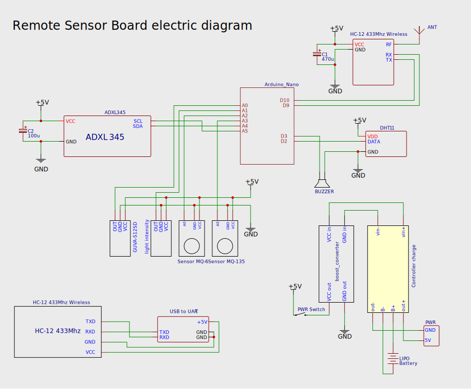

### HC-12 AT commands
**(set pin needs to be active low in order to access AT commands)**

`AT` : Test command

`AT Bxxxx` : Change the serial port baud rate. The baud rate can be set to be 1200bps 2400bps 4800bps 9600bps 19200bps 38400bps 57600bps and 115200bps. The default value is 9600bps. To set serial port baud rate of module to be 19200bps first send "AT+B19200" command to module and the module returns "OK+B19200".

`AT Cxxxx` : Change wireless communication channel, optional from 001 to 127 (for the wireless channel exceeding 100, the communication distance cannot be ensured). The default value of wireless channel is 001, and the working frequency is 433.4MHz. The channel stepping is 400KHz, and the working frequency of Channel 100 is 473.0MHz. 

e.g.:
To set the module to work at Channel 21, first send "AT+C021" command to the module, and the module returns "COK+C021". After exiting from the command mode, the module will work at Channel 21, and the working frequency is 441.4MHz. Note: As the wireless receiving sensitivity of HC-12 module is relatively high, when the serial port baud rate is greater than 9,600bps, five adjacent channels shall be staggered to use. When the serial port baud rate is not greater than 9,600bps, in short-distance (within 10m) communication, also five adjacent channels shall be staggered to use.

`AT FUx` : Change serial port transparent transmission mode of module and three modes are available, namely, FU1, FU2 and FU3. The default mode of module is FU3, and only when serial port transparent transmission mode of two modules is set to be the same, can normal communication be available. For detailed introduction, please see the above "wireless serial port transparent transmission".

e.g.:
Send "AT+FU1" to module, and the module returns "AT+0K".

`AT Px` : Set transmitting power of module, x is optional from 1 to 8. The default value is 8, and the higher the transmitting power is, the farther the communication distance is. When the transmitting power level is set to be 1, the transmitting power is the minimum. Generally speaking, every time the transmitting power is reduced by 6dB, the communication distance will be reduced by half.

e.g.:
Send "AT+P5" command to module, and the module returns "OK+P5". After exiting
from the command code, the transmitting power of module is +11dBm.

`AT Ry` : Obtain single parameter of module, y is any letter among B, C, F and P, respectively representing: baud rate, communication channel, serial port transparent transmission mode, and transmitting power.

Example 1:
Send "AT+RB" to module, and if the module returns "OK+B9600", it is inquired that
the serial port baud rate of module is 9,600bps.

Example 2:
Send "AT+RC" command to module, and if the module returns "OK+RC001", it is
inquired that the communication channel of module is 001.

Example 3:
Send "AT+RF" command to module, and if the module returns "OK+FU3", it is
inquired that the module is working in serial port transparent transmission mode 3.

Example 4:
Send "AT+RP" command to module, and if the module returns "OK+RP: +20dBm",
it is inquired that the transmitting power of module is +20dBm.

`AT Rx` : Obtain all parameters of module. Return serial port transparent transmission mode, serial port baud rate, communication channel, and transmitting power in order.

e.g.:
Send "AT+RX" command to module, and the module returns "OK+FU3\r\n
OK+B9600\r\n OK+C001\r\n OK+RP: +20dBm\r\n". ("\r\n" means return\newline)

`AT Uxxx` : Set data bits, check bit and stop bit of serial port communication. For check bit, N means no check, O means odd check, and E means even check. For stop bit, 1 means one stop bit, 2 means two stop bits, and 3 means 1.5 stop bits.

e.g.:
To send serial port format to be eight data bits, odd check, and one stop bit, please
Send "AT+U8O1" to module, and the module returns "OK+U8O1".

`AT V` : Inquire firmware version information of module.

e.g.:
Send "AT+V" command to module, and the module returns "HC-12_V1.1".

`AT SLEEP` : After receiving the command, the module enters sleep mode after exiting from AT, the working current is about 22uA, and this mode doesn't allow serial port data transmission. Then enter AT setting state again, and the module will exit from sleep mode automatically.

e.g.:
When wireless data transmission is not needed, to save power, send "AT+SLEEP" command to module, and the module returns "OK+SLEEP".

`AT DEFAULT` : Set serial port baud rate, communication channel, and serial port transparent transmission mode to be default value.

e.g.:
Send "AT+DEFAULT" to module, and the module returns "OK+DEFAULT", and the
default vale is restored. The serial port baud rate is 9,600bps, communication channel
is C001, and serial port transparent transmission mode is FU3.

`AT UPDATE` : Put the module in the status of waiting for software update. After sending the command, the module will not respond to command any more, until 
it is re-energized.

After sending the command, please close the serial port assistant, and turn on HC-1X updater to update the software. For detailed operating method, please refer to the following "software update" introduction.

