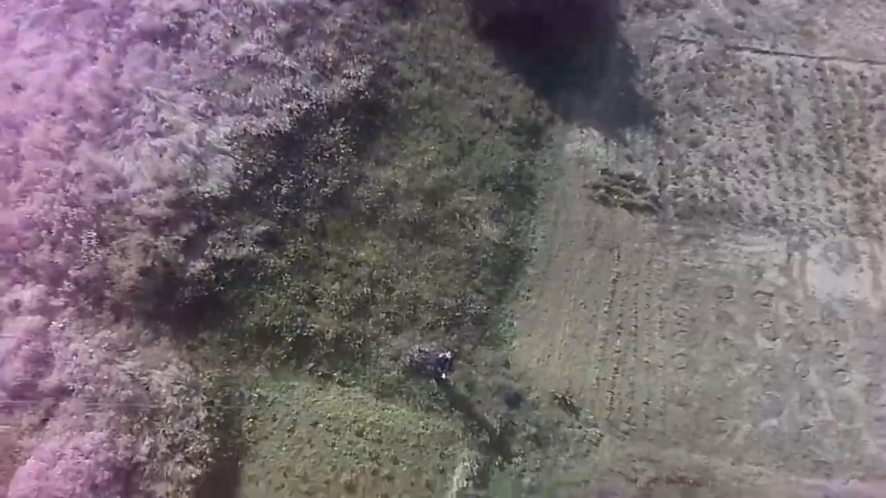

## Remote Sensor Board aka Aeronaut

#### Telemetry variables:

Uptime; air temp./hum.; UV intensity; sun brightness; CO2 level; flammable gases level; XYZ acceleration

#### Some more aerial pics:

## Payload carriers

### Big kite

DIY 1.9 x 1.5 meters, polyethylene

### Little kite

Premade 0.5 x 0.6 meters, synthetic fabric

[Offline data log file.csv](_doc/datalog_sample.csv "Data log sample")

[Youtube: "Official" video](https://www.youtube.com/watch?v=zIQhnGlwR-0)

[Youtube: Backstages video](https://www.youtube.com/watch?v=ILEu2k6CR08)

[HC-12 AT+commands](HC-12-AT.md)

And yeah, its my another school project from 2018.